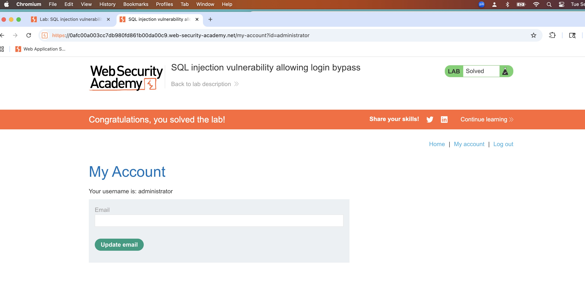

# Finding Report – PS-002

**Finding:** SQL injection login bypass (authentication)  
**Severity:** High  
**Date:** <2025-09-02>  
**Lab:** PortSwigger – SQL injection vulnerability allowing login bypass

**Endpoint / Param:** `/login` (username)

**PoC Payload(s):**

' OR 1=1--␠

_(If a different one worked, list it here. Keep exact spacing.)_

**Repro Steps:**

1. Open the login page and submit the username payload above; any password value.
2. Observe authentication bypass (see screenshot).

**Impact:**
An attacker can authenticate without valid credentials, leading to account takeover and access to sensitive user data.

**Fix:**

- Use parameterized queries / prepared statements (no string concatenation).
- Enforce strict server-side input handling; generic error messages on auth.
- Run DB account with least privilege; no access beyond required tables.
- Temporary mitigation: WAF rule to deny obvious patterns like `' OR 1=1`.

**Artifacts:**

- Screenshot:
  
  [Open file](../../evidence/ps-sqli/login-bypass.png)
- Request snippet:
  [request.txt](../../evidence/ps-sqli/login-request.rtf)

**Notes (optional):**

- Working payload variant: `<paste the exact one you used>`
- Response status observed: `<200/302>`; app indicates logged-in state via `<text/URL>`.
