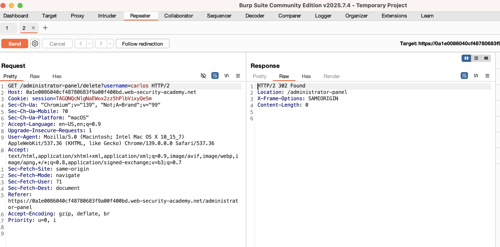

# PS-005 — Access Control: Unprotected Admin Functionality
**Date / Analyst:** 2025-09-05 — Christopher Araque
**Environment:** PortSwigger WSA — beginner access control lab

## TL;DR
- Admin endpoints were reachable by a non-admin user.
- Performed admin-only action successfully.
- Fix: enforce server-side role checks on every admin route; remove sensitive paths from robots; least-privilege.

## Scope & Target
- **Endpoint(s):** e.g., /admin, /admin/delete?username=carlos
- **Auth context:** Logged in as non-admin user shown by the lab, e.g., carlos
- **Method**: GET

## Steps to Reproduce
1) Enumerate admin path(s) (robots.txt, direct browse).
2) Access panel as non-admin; identify admin action.
3) Execute action; observe success.

## Evidence
- Screenshot:
  
- Request:
  [PS-005-request.txt](../../evidence/ps-access/ps-005-requests.txt)

## PoC (key lines)
**Action executed as non-admin:**
Request
GET /administrator-panel/delete?username=carlos HTTP/2
Host: 0a1e0086040cf48780683f9a00f400bd.web-security-academy.net
Cookie: session=<redacted>

Response
HTTP/2 302 Found
Location: /administrator-panel
X-Frame-Options: SAMEORIGIN
Content-Length: 0

## Impact
Unauthorized administrative actions (account deletion/role changes), leading to account takeover or service disruption.

## Recommended Fix
- Server-side authorization on all admin routes (role/permission checks).
- Do not expose admin paths; defense-in-depth (rate-limit/WAF for admin endpoints).
- Least-privileged app/service accounts; audit logs/alerts for admin actions.
