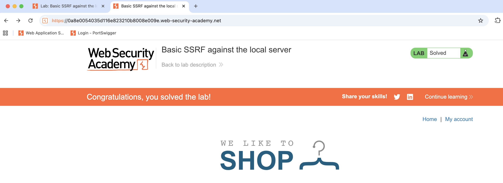

# PS-008 — SSRF (Basic)
**Date / Analyst:** $(date +%F) — Christopher Araque

## TL;DR
The application fetches a user-supplied URL server-side without proper allow‑listing.
An attacker can coerce requests to **internal endpoints** or **cloud metadata**.

## Target Pattern
- Endpoint: e.g., `POST /stock` with JSON `{"url":"http://example.com/item"}`
  or `GET /fetch?url=http://site/...`

## Steps to Reproduce
1) Identify a feature that **fetches a URL** server-side (stock check, image fetch, PDF fetch).
2) Send internal/localhost URLs:
   - `http://127.0.0.1/`
   - `http://localhost/`
   - `http://169.254.169.254/latest/meta-data/`   (cloud metadata)
3) Observe server response (status/body/timing) proving the server made the request.

## Evidence
- Request/Response: [ps-008-request.txt](../../evidence/ps-ssrf/ps-008-request.txt)
- Screenshot: 

## Example Payloads
http://127.0.0.1/
http://localhost/admin
http://169.254.169.254/latest/meta-data/
http://169.254.169.254/latest/meta-data/iam/security-credentials/

## Impact
Access to internal services or cloud metadata → credential exposure, pivot, privilege escalation.

## Recommended Remediation
- **Allow‑list** known-good domains; block private IP ranges (RFC1918, 127.0.0.0/8, 169.254.0.0/16, ::1, etc).
- Normalize/resolve DNS before checks; fetch via an **egress proxy** with filtering.
- Disable redirects to internal addresses; use metadata‑proxy or IMDSv2 (AWS).
